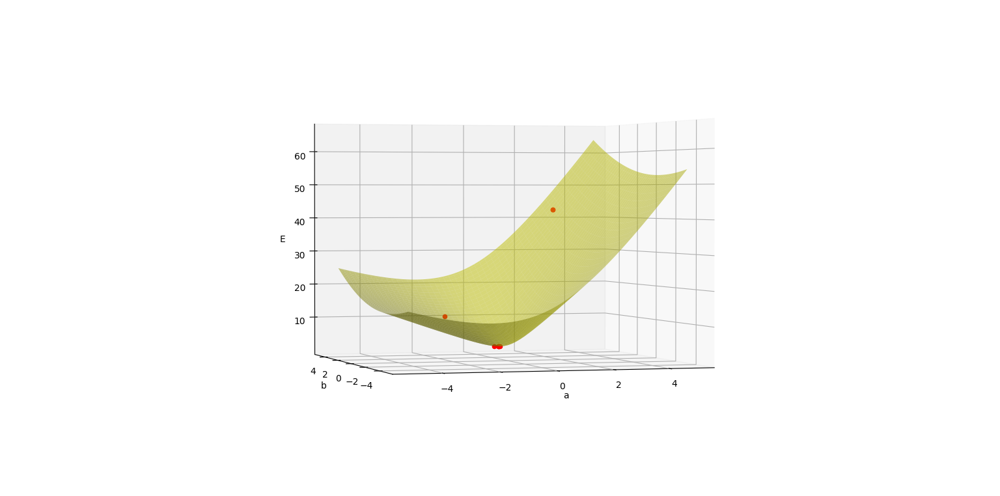
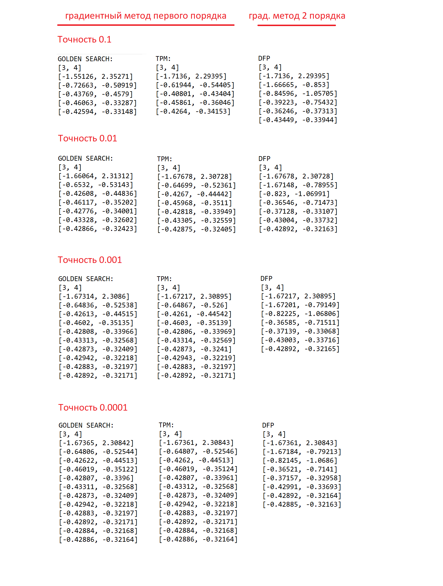
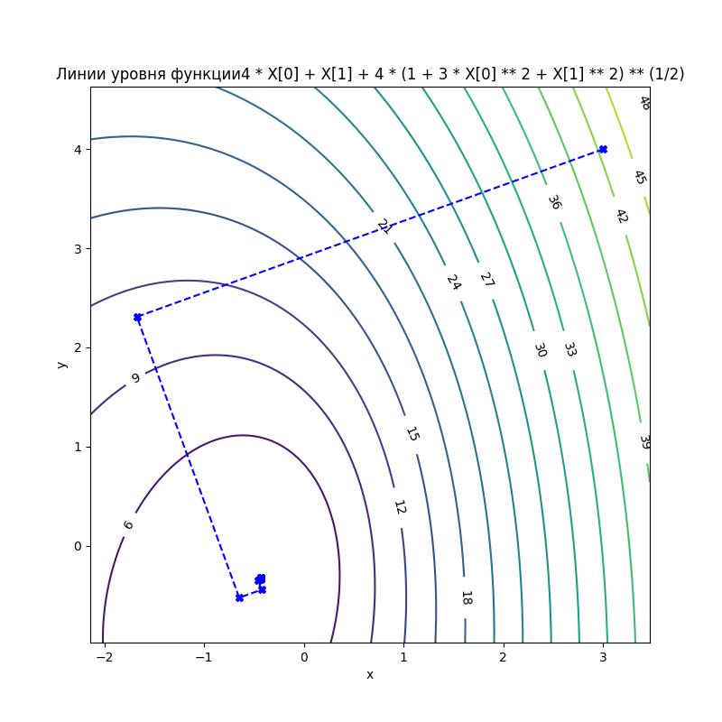
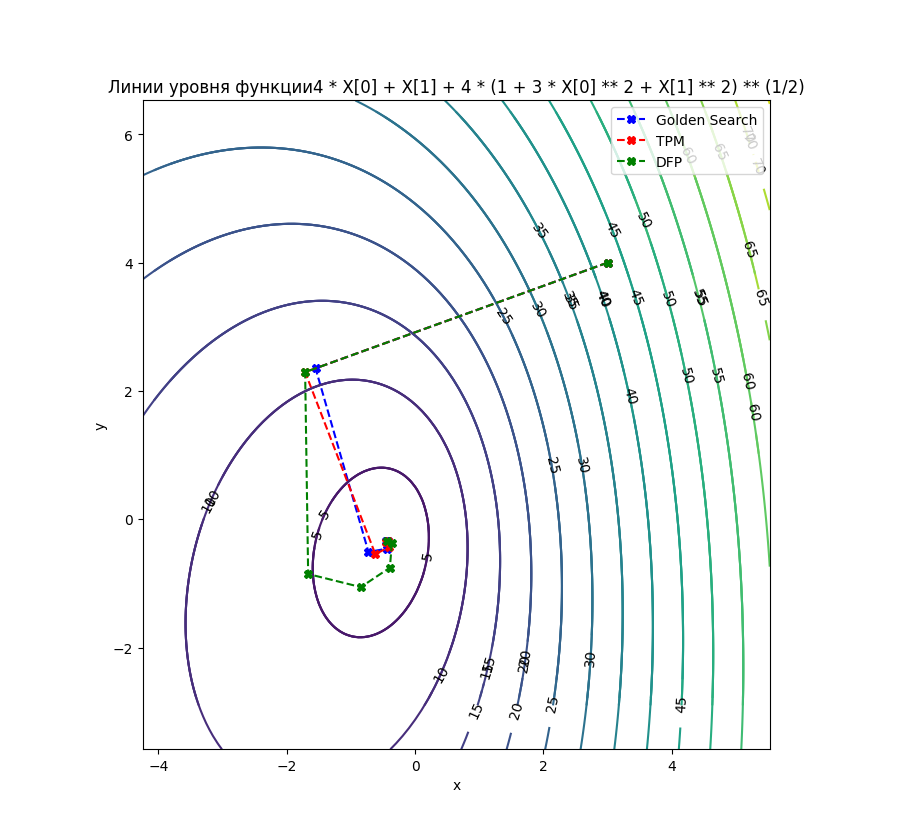
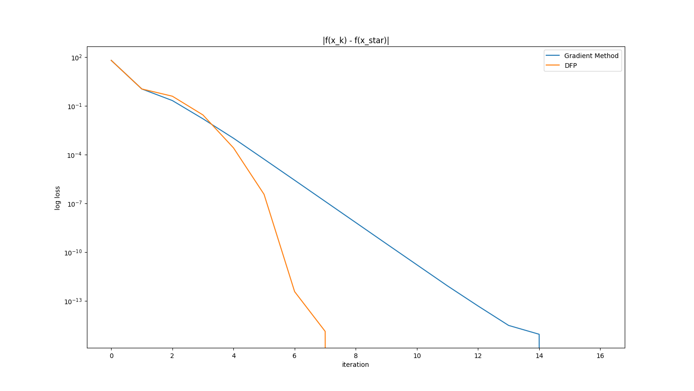

## Solving multi-dimensional minimization problems

- [Solving multi-dimensional minimization problems](#solving-multi-dimensional-minimization-problems)
  - [Description](#description)
  - [Get started](#get-started)
  - [Project structure](#project-structure)
  - [Results](#results)


### Description
Let's give a two-dimensional minimization problem 

$f(x)=4x_1+x_2+4\sqrt{1+3x_1^2+x_2^2}$.



Required:

1. Implement a gradient method of the first order of the steepest descent with a step search using the methods of the golden section and trial points
2. Draw lines of levels of the goal function
3. To show during the computational experiment the orthogonality of the links of the gradient polyline in two consecutive iterative steps for an accuracy of 0.01
4. To implement the DFP method - the gradient method of the second order
5. Solve the problem with an accuracy from $10^{-1}$ to $10^{-4}$
6. Perform a comparative analysis of algorithms of methods

### Get started
```bash
git clone https://github.com/IMZolin/multi-dimension-minimization <your project name>
cd <your project name>
pip install -r requirements.txt
```

### Project structure
```bash
├───graphics            # images:graphics+scheme of simplex
├───report
│   └───lab3_opt_methods.pdf 
├───src                 # code
│   ├───golden_egg.py      # Golden Ratio Method
│   ├───main.py  # corner dots 
│   ├───One_D_Problem_file.py # one dimension minimization problem class
│   ├───result_analisys.py  # get results
│   ├───test_uniform.py # test code for running uniform search method
│   ├───result_analisys.py # get results
│   ├───Trial_Point_Method_file.py # Trial Point Method
└───────uniform_search.py # Uniform Search Method
```

### Results

1. Solutions of MultiDimension minimization problem(ru)

2. The lines of levels of the goal function(golden search method)

3. The lines of levels of the goal function(all methods)

4. Comparison of methods

